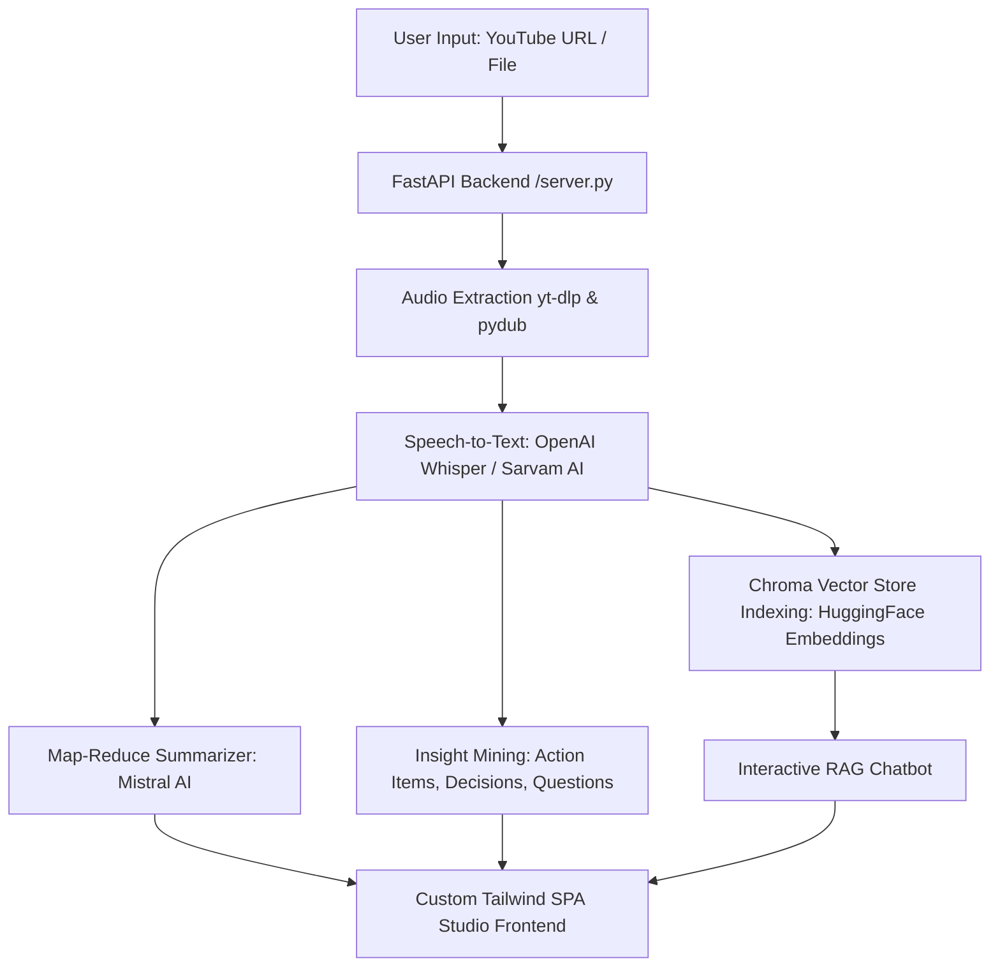

# VideoIntel AI — Video & Audio Intelligence Studio 🚀

[](https://fastapi.tiangolo.com/)
[](https://www.python.org/)
[](https://tailwindcss.com/)
[](https://mistral.ai/)
[](https://github.com/openai/whisper)
[](https://www.trychroma.com/)
[](LICENSE)

**VideoIntel AI** is a full-stack AI media processing and intelligence platform. It transforms YouTube videos and audio files (`.mp4`, `.mp3`, `.wav`, `.m4a`) into structured executive summaries, practical takeaways, key decisions, and interactive RAG vector search chatbots.

---

## ✨ Features

> [!NOTE]
> **Cloud Deployment & YouTube Bot Detection**: YouTube aggressively blocks datacenter IP addresses (Render, AWS, GCP). YouTube URL processing works best in local development or with a proxy configured (`YTDLP_PROXY`). For cloud hosting deployments, direct **File Upload** (`.mp4`, `.mp3`, `.wav`, `.m4a`) is the recommended, 100% reliable production path.

- **🔗 Dual Input Options**: Process YouTube URLs (videos, shorts, podcasts) or drag-and-drop local media files.
- **🎙️ Dual STT Engines**: Local **OpenAI Whisper** (English) and **Sarvam AI** (Hinglish/Hindi audio translation).
- **📝 General-Purpose AI Insights**: Generates executive summaries, practical steps/recommendations, key decisions/findings, and open questions/topics.
- **💬 Interactive RAG Vector Chat**: Ask any question about the video content; answers are retrieved from a Chroma vector store via **Mistral AI**.
- **📜 Transcript Inspector**: View, copy, and search lines inside the transcript in real-time.
- **📥 One-Click Export Package**: Download formatted **PDF** (ReportLab) or plain **TXT** reports.
- **🎨 Modern Studio UI**: Clean White & Light Blue split-screen studio layout.

---

## 🏗️ System Architecture



---

## 🛠️ Project Structure

```
Video_Analyzer/
├── core/
│   ├── extractor.py        # Action item, decision & question mining
│   ├── rag_engine.py       # LangChain LCEL RAG chain pipeline
│   ├── summarizer.py       # Map-reduce transcript summarization
│   ├── transcriber.py      # OpenAI Whisper & Sarvam AI STT routers
│   └── vector_store.py     # Chroma vector database manager
├── utils/
│   ├── audio_processor.py  # Audio downloading, conversion & chunking
│   └── exporter.py         # PDF and TXT report generators
├── static/
│   ├── index.html          # Split-screen studio HTML SPA
│   ├── app.js              # Frontend API client & interactive UI logic
│   └── style.css           # Light theme CSS styling
├── server.py               # Production FastAPI REST API server
├── main.py                 # CLI pipeline entry point
├── Requirements.txt        # Python package dependencies
├── Dockerfile              # Docker container build script
├── Procfile                # Render / Railway process file
├── render.yaml             # Render.com cloud deployment config
├── .env.example            # Environment variables template
└── README.md               # Repository documentation
```

---

## 🚀 Quick Start (Local Setup)

### 1. Prerequisites
- Python 3.10+ installed
- [FFmpeg](https://ffmpeg.org/) installed and added to System PATH

### 2. Installation
```bash
# Clone repository
git clone https://github.com/krishna-2326/Video_Analyzer.git
cd Video_Analyzer

# Create virtual environment
python -m venv venv
# On Windows:
venv\Scripts\activate
# On Linux/macOS:
source venv/bin/activate

# Install dependencies
pip install -r Requirements.txt
```

### 3. Environment Variables
Copy `.env.example` to `.env` and set your API keys:
```bash
cp .env.example .env
```
In `.env`:
```env
MISTRAL_API_KEY=your_actual_mistral_api_key_here
WHISPER_MODEL=base
```

### 4. Run the Server
```bash
python server.py
```
Open **[http://localhost:8000](http://localhost:8000)** in your browser!

---

## 🌐 Live Cloud Deployment Guide

### Option A: Render.com (Recommended Free Hosting)
1. Push this repository to GitHub:
   ```bash
   git add .
   git commit -m "Initial release of VideoIntel AI"
   git branch -M main
   git remote add origin https://github.com/krishna-2326/Video_Analyzer.git
   git push -u origin main
   ```
2. Go to **[dashboard.render.com](https://dashboard.render.com)** $\rightarrow$ **New +** $\rightarrow$ **Web Service**.
3. Connect `krishna-2326/Video_Analyzer`. Render will detect `render.yaml`.
4. In **Environment Variables**, add `MISTRAL_API_KEY`.
5. Click **Deploy**. Your live HTTPS link (e.g., `https://video-analyzer.onrender.com`) will be active in ~2 minutes!

---

### Option B: Hugging Face Spaces (Free Docker Container)
1. Go to **[huggingface.co/spaces](https://huggingface.co/spaces)** $\rightarrow$ **Create new Space**.
2. Select **Docker** as the SDK.
3. Upload these project files (including `Dockerfile`).
4. Set `MISTRAL_API_KEY` under Space Settings $\rightarrow$ Repository Secrets.

---

## 📜 License
Distributed under the **MIT License**. See `LICENSE` for more information.
